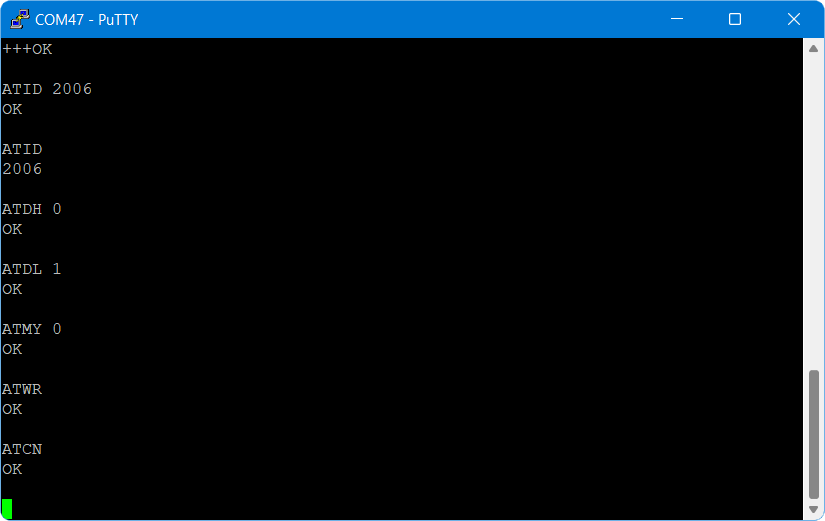

# Lab 3: communication

In this lab you will build FlatSAT's communication system including the onboard radio, antenna, and ground station. You will test communication and measure signal strength at multiple link distances to characterize the link budget and ensure FlatSAT has sufficient link margin to communicate from orbit. 

In this lab one laptop will serve as FlatSAT's ground station. The ground station computer will send commands to the spacecraft over an XBee serial link. 

One additional laptop is required to power FlatSAT. 

prelab report instructions: [https://www.overleaf.com/read/qksywqwkjcqb#3d1ec1](https://www.overleaf.com/read/qksywqwkjcqb#3d1ec1)

## equipment

- 2 laptops
- micro USB cable
- ruler and measuring tape

## hardware

- FlatSAT
  - components from previous labs
  - XBee radio with integral PCB antenna
    - on Explorer adapter board
  - laptop for USB power
- ground station
  - laptop with serial terminal (Tera Term)
  - XBee radio with RP-SMA RF connector
    -  on USB Explorer adapter board
  - 2x antenna (2 different lengths)
  
- LED and 220 Ω resistor

## software

- Arduino IDE
- Arduino SAMD drivers (already installed)
- `Tera Term` serial terminal program
  - install if necessary: website or command line
    - [https://github.com/TeraTermProject/teraterm/releases](https://github.com/TeraTermProject/teraterm/releases)
    - `winget install teratermproject.teraterm`
  
- `lab_03_communication.ino`

## lab report

instructions: https://www.overleaf.com/read/qksywqwkjcqb 


## overview

In this lab the XBee–XBee link will act as a wireless serial connection. 

Ground-to-space communication:


After receiving a command, FlatSAT will produce a response and return it to the ground station using the same link in reverse. 


The radios need to be programmed with compatible parameters (channel, etc.) before they can communicate. In this lab the ground station radio is programmed once using AT commands sent from the ground station serial terminal. You will modify your Arduino (once) code so that each time FlatSAT reboots it will program the radio. 

Each XBee radio maintains a record of the signal strength of the last message it received. An RSSI query from the ground station involves the following steps:

- query message from ground station via XBee to FlatSAT
- (FlatSAT XBee keeps record of the query message’s RSSI since it is the latest message)
- Arduino asks FlatSAT XBee for RSSI
- FlatSAT XBee responds in hex format
- Arduino converts response to ASCII decimal format
- Arduino sends RSSI string via XBee to ground station


## setup

- connect XBee radio to FlatSAT
  - as listed in `xbee_pins.h`

- Add LED and 220 Ω resistor 
  - as listed in `LED_pins.cpp`
  - LEDs are directional—short leg of LED connects to ground through resistor
  - LEDs will burn out without a resistor
  


### XBee breakout

The XBee radio communicates with Arduino using serial communication. Serial communication uses two wires: transmit and receive. 


## Channel selection

Select a channel number (PAN ID) between 0 and 9999. You will program this channel on both ends of your radio link. It must be different than the channel selected by other groups. Write down your channel number for reference. 


## Program FlatSAT

- Connect FlatSAT to a PC with Arduino IDE and Tera Term installed
- Connect ground station radio to the same PC
- Open `lab_03_communication.ino`
- From the tools menu, select the correct board (MKR Zero) and port
- In `lab_03_ communication.ino`, modify this line with your selected Network ID (PAN ID). 

```
// Network ID for XBee communication
// select a number between 0 and 9999
int PAN_ID = 2006; 
```

- Upload the file to the Arduino. You should see the LED labelled “L” on the Arduino board blink three times in rapid succession when the upload completes. You will also get a message in the black dialog box at the bottom of the IDE window. If you have any errors uploading, double check that you have the correct board and port selected. 
- In Arduino IDE, click on the device/port drop down to identify the port used by the ground station radio. It will show up on a serial port (COMXX) as an unknown device. Record this number. 


## Setup the ground station

- If your FlatSat radio has an RP-SMA connector, attach a small antenna to it.


- If you don't already have the serial port number of your ground station antenna (COMXX), find it from device manager

  - Open Device Manager on the lab station PC, and click on “Ports.” Note which port number is assigned to your ground antenna.

  

- open `Tera Term`

- in the new connection dialog, open a connection to the ground station radio

  - serial

  - Port: COMXX (use the 1- or 2-digit number you recorded)

  - OK

- if necessary, configure the serial port

  - speed: 9600 
  - data: 8 bit
  - parity: none
  - stop bits: 1 bit
  - flow control: none

- open the serial connection

- type the following commands 

  - (do not type words in parentheses)
  - [DO press the enter key in brackets]


```
(wait 1 second)
+++ (do not type enter)
(wait for XBee to return "OK")
ATID [PAN_ID] [enter] (note, type the digits of your PAN_ID)
ATID [enter] (verify correct channel) 
ATDH 0 [enter]
ATDL 1 [enter]
ATMY 0 [enter]
ATWR [enter]
ATCN [enter]
```




## test link

FlatSAT and the ground station should now be connected and communicating. Restart FlatSAT (the small blue button on the Arduino). The terminal on the ground station PC should display a welcome message. If not, reopen your serial connection and restart FlatSAT. 

If the link doesn’t work, connect to FlatSAT with the serial monitor and look for error messages. 

(You should start to see messages from Arduino. If they end with “ Received: OK and 0 0” then you are good to go. If the messages continue to autoscroll without stopping, you will need to disconnect your USB cable from your laptop and close the serial monitor. Then you will need to re-connect the USB cable to your laptop and re-open the serial monitor. If you do not get the “OK” message in the serial monitor the second time, double-check that you connected all of the wires correctly.)


## Sending and Receiving Data

FlatSAT responds to the following commands. 

```
1 help
2 get RSSI
3 toggle LED
```

- Type 3 to toggle the LED. 
- Type 2 to get XBee’s current RSSI. 
- collect RSSI values at the following distances

| distance (m) | RSSI (dB) |
| ------------ | --------- |
| 0.5          |           |
| 1            |           |
| 2            |           |
| 5            |           |

At each distance, also toggle the LED. 

Next, repeat the RSSI measurement at 5 m with a different size antenna. Record this RSSI value and the antenna change. 

Finally, see how far FlatSAT can communicate. If you go outside, call your teammate on the telephone to establish out of band communication. Record your RSSI at distance and use https://gmap-pedometer.com/ to determine your separation. 


## Lab station cleanup

- Disconnect devices from all computers
- Remove the ESD wrist straps and replace them in the bag at your lab station.
- Replace all items at your lab station the way you found them. 
- Have your instructor check off your lab station before you depart.
