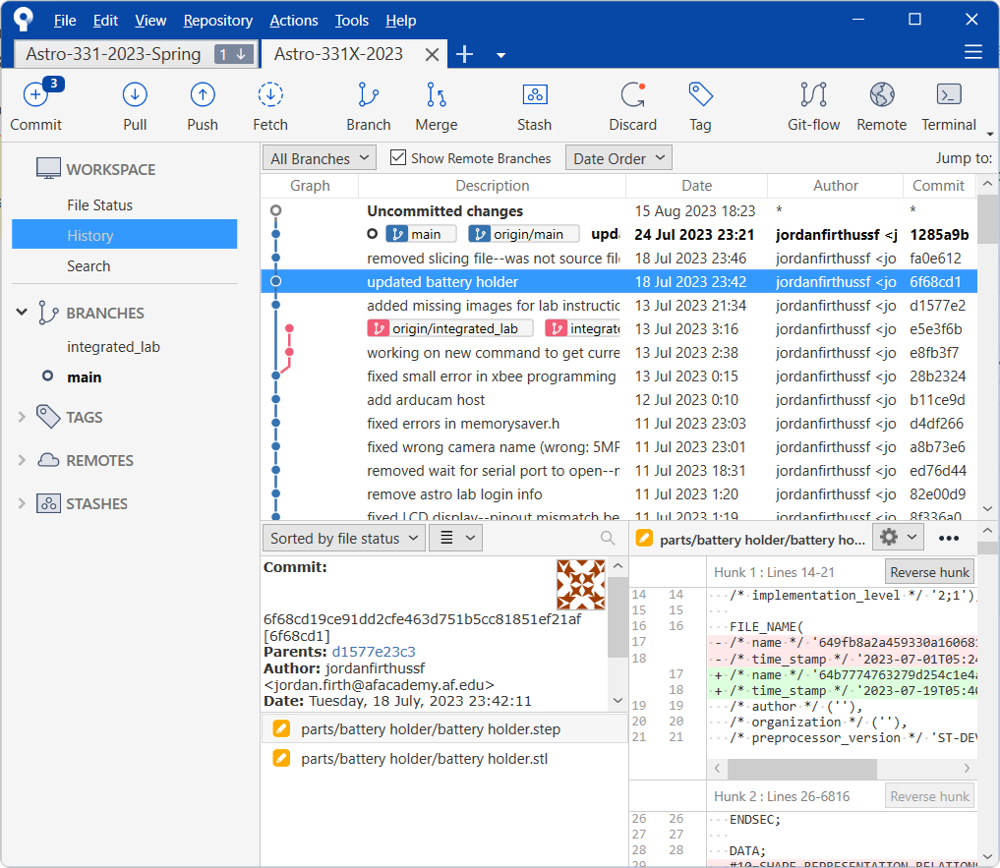
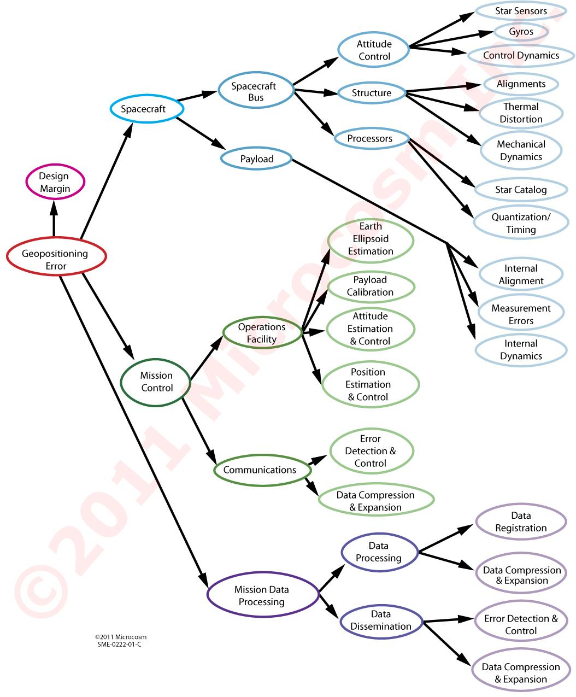
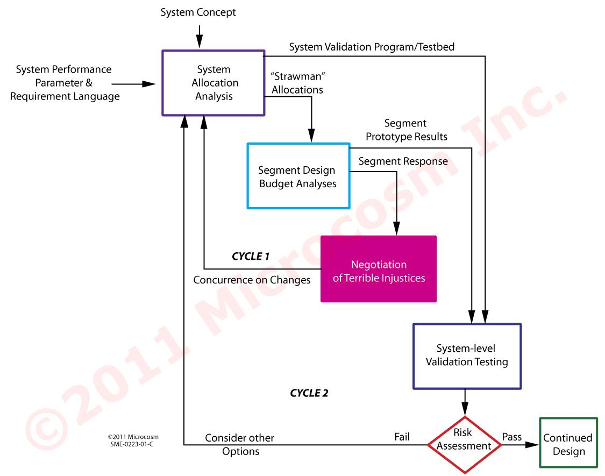
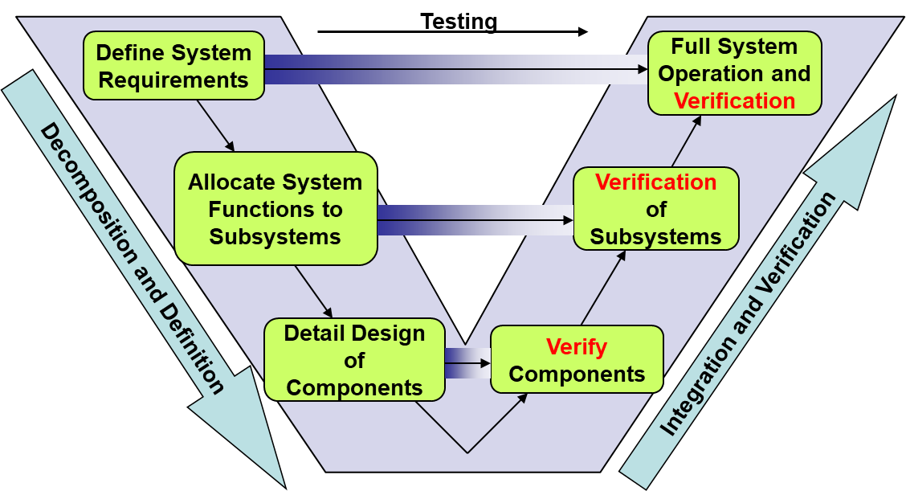

# 02: requirements and mission design 

## admin

### assignments

hand out skills review—due Tuesday

HW?

### software configuration and installation

Why does 331 use git/github for version control/file distribution?

- It’s the better alternative to copying files from a thumb drive
- with one operation, you can be sure you have the latest version of everything 
- nearly the whole software world uses git for version control

Beyond code and instructions, 331 material is inspired by the philosophy of *configuration-as-code*. 

- as much as possible, required programs, libraries, settings, etc. are included as code/scripts
- this method favors command-line tools
- this method greatly simplifies distribution and configuration control (vs manually downloading and installing programs and settings)
- this is basically required when using student laptops

 

brief overview of git

- version control
  - only one named version of any single file
    - can retrieve previous versions if necessary
    - can manage/fork/merge multiple simultaneous versions if necessary
- repository = project folder/directory (almost equals)
  - local repository (your computer) vs remote repository (github.com)
  - git doesn’t know about changes or new files until you *commit* them (to your local repository)
- syncing changes between repositories
  - instructor **pushes** changes to github
  - you **pull** changes from github

**sourcetree** provides good overview of project—good for visualizing more complicated changes

**tortoisegit** convenient windows explorer integration

#### copy class repository to your computer

- in Windows Explorer, navigate to the location you want your 331 repository (probably My Documents)
- right click -> git clone -> paste URL -> OK
  - https://github.com/usafa-astro-331/astro-331-2024-spring.git 
- git created a new folder for you, with the current class contents from github

#### install additional software

You will need several programs for this class. Your local copy of the class repository now contains a batch script to install all of them. However, you should inspect the batch script first. 

***You should never blindly run a batch script.***

- follow the instructions in `computer_environment/README.md` (open using any text editor)

#### configure software

Now you can view formatted instructions in marktext—markdown documents can be read in a text editor but look better (and include graphics) in a markdown editor.

- open `computer_environment/README.md` in marktext
- follow the instructions in the “update arduino” section

## requirements

Most* programs start with defining customer requirements (requirements-based acquisition). 

​	(FalconSAT uses a capabiltities-based model.)

### exercise

at the board with your table, spend 2-3 min proposing a space mission

- who are you (what organization)?

- what is your problem?

  - what do you want from your system?

  - why do you want it?

critique: when should you pursue a space system as a solution?

​	Only when there’s no other way to accomplish your objective. 

### requirements vs constraints

from https://edward-designer.com/web/assumptions-vs-constraints-vs-requirements-pmp-exam/

**Requirements**: these  are features/capabilities/products/deliverables that expected to be  delivered from the project as interim or end results.

- Requirements focus on the capability of the deliverable rather than the project itself

**Constraints**: these are factors that need to be taken into accounts when planning the project. Constraints are mostly restrictions imposed *on the project*. In the PMBOK® Guide, constraints include a  total of 6 competing project constraints:

- **Scope** – what are required/expected of the project?
- **Time** – when will the project need to be finished?
- **Cost** – how much money is provided?
- **Quality** – what is the expectation of the outcome? high or just okay?
- **Resources** – who are the working team members? what equipment/materials are provided?
- **Risk** – what can go wrong with the project and how to deal with them?

### example:

demonstrate requirement allocation (big-to-little/left-to-right) and closure (little-to-big)

Requirements will usually be written as sentences or paragraphs:

- Attitude control system will maintain bus pointing within 1 degree. 
  - Star sensors will provide accurate bus orientation knowledge with a maximum expected error of 0.2 degree. 

### good properties

- **Unique:** no two rqmts overlap or duplicate each other
- **Unambiguous:** no misunderstanding of exactly what is required
- **Testable:** practical way of determining whether delivered system actually meets rqmt
- **Traceable:** every high-level rqmt is broken down into one or more low-level testable requirements and every low-level rqmt supports a documented high-level rqmt
- **Consistent:** doesn’t conflict with other rqmts
- **Specific:** focuses on one thing
- **Essential:** creates a deficiency if deleted
- **Complete:** not missing any conditions or constraints that would distinguish an acceptable system from an unacceptable system

### bad 
**Multiple Rqmts**
- And
- Or

**Conditional Clauses**
- If
- Once
- When
- Unless
- Except
- Although
- Always

**Subjective Phrases**
- User-friendly
- Easy
- Simple
- Rapid
- Efficient
- Several
- State-of-the-Art
- Improve
- Maximize
- Minimize
- Optimize
- Adequate
- Flexible
- Approximately
- Modern
- Versatile
- As possible
- Facilities
- Support
- High performance
- Large
- Intuitive
- Robust
- Sufficient

## Systems engineering V-diagram

verification at each level

- verify complete system at the end

- can’t verify complete system until the system is complete
- need to verify components/subsystems along the way

allocation/closure

note what’s missing: build the system

## mission design

Nearly all missions we (USSF) are interested in involve sensing EM radiation and transmitting information back to Earth via another EM channel.

- requirements
  - coverage
    - swath width, revisit rate, # of spacecraft in view, etc. 
  - resolution

### review examples

- SMAD’s FireSAT example (lesson 2 powerpoint)

- NASA’s [ISS Crew Transportation and Services Requirements Document](https://ntrs.nasa.gov/citations/20170001943)
  - 3.2 safety and mission assurance
  - 3.2.5 emergency equipment
  -  3.2.5.2 breathing mask (page 39)

## Homework

- by next lesson
  - page 2 of homework packet
- by T5/M6
  - Skills review

