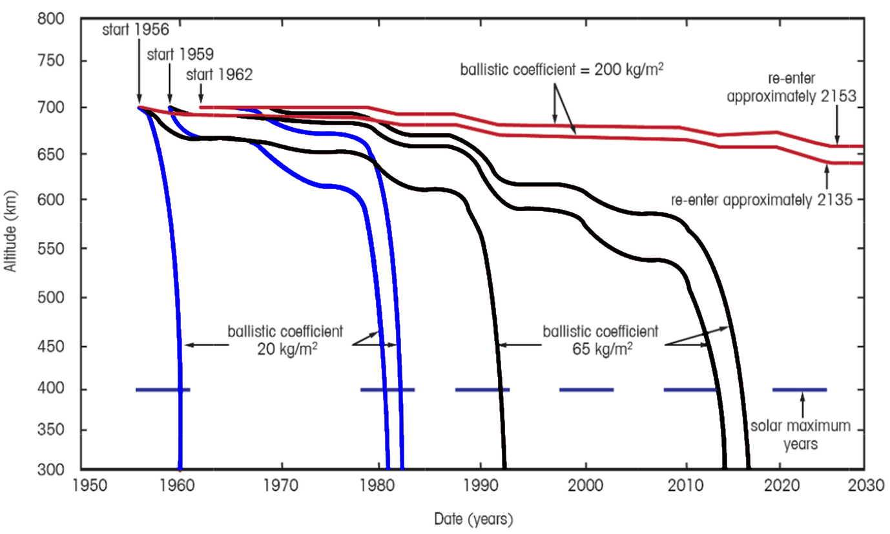

# 03: astrodynamics, mission geometry, constellations

## admin

### assignments

collect HW

skills review due T5/M6

### repository update

Do this before every class to get the latest lesson notes, labs, etc.

​    right click folder -> git sync -> pull

​    *log* tab should show “success”

For instructors: git/github is *way* better better than a share drive 

- share drives (onedrive, teams, etc.) offer basically no version control

For students: using git this way in 331 is not much different than a share drive. Hopefully you’ll be less intimidated by it in the future though. 

## astrodynamics

This is not an astrodynamics class, but we must account for astrodynamics in lifetime planning. 

- transfer to mission orbit
- station-keeping
  - counter perturbations due to:
    - lumpy earth
    - 3rd bodies
    - drag
    - solar radiation pressure
- end-of-life disposal

What are end-of-life options? Who enforces that?

### astrodynamics in Astro 310:

**2-body motion**:
$$
m\vec{a} = \vec{F}_g = \frac{G m_1 m_2}{R^2}\hat{R} = \frac{\mu m}{R^2}\hat{R}
$$

**Plus**: drag exists (no math)

- it makes spacecraft re-enter

**Plus**: J2 exists (no math)

- orbits are sun-synchronous around 97° inclination
- Molniya-like orbits freeze perigee

### perturbations

> noun: **perturbation**
> 
> 1. anxiety; mental [uneasiness](https://www.google.com/search?client=firefox-b-1-d&sa=X&sca_esv=557881931&biw=1852&bih=1008&sxsrf=AB5stBgA3cJLEEKSadn-TE1ocnPKeiMaPw:1692306476012&q=uneasiness&si=ACFMAn9-5A9OMKPWcg180I9o9Mnd7Kn9BbavpSugKIB9K-of2C8ig36CI3stoodalk7DZMPM-iNe2Hrde17mat7q4wi8FwAi2g%3D%3D&expnd=1).
>    
>    *"she sensed her friend's perturbation"*
>    
>    - a cause of anxiety or uneasiness.
>      
>      *"Frank's atheism was more than a perturbation to Michael"*
> 
> 2. **a deviation of a system**, moving object, or process **from its regular** or normal state or **path**, caused by an outside influence.
>    
>    *"some minor perturbation in his house's cash flow"*
>    
>    - Astronomy
>      
>      a minor deviation in the course of a [celestial](https://www.google.com/search?client=firefox-b-1-d&sa=X&sca_esv=557881931&biw=1852&bih=1008&sxsrf=AB5stBgA3cJLEEKSadn-TE1ocnPKeiMaPw:1692306476012&q=celestial&si=ACFMAn8hzZSJQsgXIYlkGc-z1vmpzcVg4gcCYAo5ORs3K3QW9EXQe2SBF5hkUWr8PUTTgIdnfl4SIHtWT4Oy01XAxpX6FWXe4A%3D%3D&expnd=1) body, caused by the [gravitational](https://www.google.com/search?client=firefox-b-1-d&sa=X&sca_esv=557881931&biw=1852&bih=1008&sxsrf=AB5stBgA3cJLEEKSadn-TE1ocnPKeiMaPw:1692306476012&q=gravitational&si=ACFMAn_0bWhb_Mv__RK5Qa4gQeQPYyJgJzYW301ve6aYH6q5Q8Sd95rJIujMQzZ1VRuCA-gQipMc6_L3Nk-_RGoWV52e83KlZM36f6w_ZtZLYGB4imy77nw%3D&expnd=1) attraction of a [neighboring](https://www.google.com/search?client=firefox-b-1-d&sa=X&sca_esv=557881931&biw=1852&bih=1008&sxsrf=AB5stBgA3cJLEEKSadn-TE1ocnPKeiMaPw:1692306476012&q=neighboring&si=ACFMAn-3JZRSzQzizXTr4ubOpZcLSlAJhpHVrA0sSc-pM745mGYp9whTA8qx8K_H3M6eC-LfKvh7v4hXOoVGXCkPlDOAzXl1Bw_d87YuVUNS6rGz7qnEQfM%3D&expnd=1) body.
> 
> Google: Definitions from [Oxford Languages](https://languages.oup.com/google-dictionary-en)

In Astro 310, J2 and drag were discussed as perturbations. In Astro 321 they are *modeled* as perturbations (you did math with them). 

Daily life: potholes, shoving brothers

Now we need a richer vocabulary to discuss perturbations. 

- secular (non-periodic)
  
  - asymptotic
  - exponential
  - linear
  - step

- periodic
  
  - long-period
  - short-period

These can apply to any system. We will apply them to orbits. 

Classify these:

1. speed change due to true anomaly
2. speed change due to atmospheric drag
3. RAAN drift due to J2
4. inclination drift
5. Milstar: speed change due to mountains/oceans
6. GPS: speed change due to mountains/oceans
7. Starlink: speed change due to mountains/oceans

|      | a   | e   | i   | $\Omega$ | $\omega$ |
| ---- | --- | --- | --- | -------- | -------- |
| drag | x   | x   |     |          |          |
| J2   |     |     |     | x        | x        |
| sun  |     |     |     | x        | x        |
| moon |     |     | *   | x        | x        |

*it’s complicated

#### perturbation equations

rates in rad/s, distances in km

$$
n = \sqrt{\frac{\mu}{a^3}} = \frac{2 \pi}{Per}
$$

##### RAAN drift

$$
\dot{\Omega}_{J2} = -4.171\times 10^7 \ a^{-7/2} \ \cos i
$$

$$
\dot{\Omega}_{moon} = -7.87\times10^{-17} a^{3/2} \cos i
$$

$$
\dot{\Omega}_{sun} = -3.58\times10^{-17}a^{3/2} \cos i
$$

##### perigee drift

$$
\dot{\omega}_{J2} = 2.085\times 10^7 (4-5 \sin^2 i) \ a^{-7/2} 
$$

$$
\dot{\omega}_{moon} = 3.72\times10^{-17}a^{3/2} (4-5\sin^2 i)
$$

$$
\dot{\omega}_{sun} = 1.79\times10^{-17} a^{3/2}(4-5\sin^2 i)
$$

#### drag

Spacecraft lifetime varies due to ballistic coefficient and solar activity. 

](sources/historical_solar_flux2.jpg)

ISS altitude 1998–2014

Supply failures:

2014-10-28: [Cygnus](https://www.youtube.com/watch?v=ef2Y0DecP8A)
2015-04-28: Progress (reached orbit with insufficient fuel)
2015-06-18: Dragon

Bonus: ISS reboost 
[https://youtu.be/hfO0wIXAxmI](https://youtu.be/hfO0wIXAxmI)
video is sped up 8x; watch at 1/8 speed for real-time

## mission geometry

SMAD Ch 5.2-5.3

| symbol        | meaning                        | symbol | meaning                |
| ------------- | ------------------------------ | ------ | ---------------------- |
| $\lambda$     | Earth central angle            | $\eta$ | nadir angle            |
| $\lambda_0$   | Earth central angle to horizon | $\rho$ | Earth angular radius   |
| H             | altitude                       | D      | line-of-sight distance |
| $\varepsilon$ | elevation angle                | SSP    | sub-satellite point    |

$$
\sin \rho = \cos \lambda_0 = \frac{R_E}{R_E+H} 
$$

$$
\sin \eta = \cos \varepsilon \sin \rho 
$$

$$
\tan \eta = \frac{\sin \rho \sin \lambda}{1-\sin\rho \cos\lambda}
$$

$$
\eta + \lambda + \varepsilon = 90° 
$$

$$
D = R_E \frac{\sin\lambda}{\sin\eta}
$$

time spacecraft is in view of ground station

$$
T = \frac{P}{180°} \cos^{-1}\left( \frac{\cos\lambda_{max}}{\cos \lambda_{min}} \right)
$$

maximum pass time occurs when spacecraft passes directly overhead

$$
T_{max} = P\left( \frac{\lambda_{max}}{180°} \right)
$$

Rules of thumb:

- average pass duration $\approx$ 80% of $T_{max}$
- 86% of passes will be longer than $\frac{T_{max}}{2}$

## constellations

how many spacecraft do you need for your mission?

how will you measure success?

| metric             | example             |
| ------------------ | ------------------- |
| revisit rate       | Planet Labs: 14/day |
| max gap            | SMAD: FireSAT       |
| spacecraft in view | GPS: >4             |
| % coverage         |                     |

Mapping: you’ll use STK in Astro 332

How will you arrange those spacecraft? 

GPS: Walker-Delta constellation

4 spacecraft in 6 planes (24 total, + spares) at 55° inclination with a 12-hr period

[https://starlink.sx/](https://starlink.sx/)

### takeaway

the world needs more and worse spacecraft!

## homework

- by Tuesday
  - Skills review
  - HW
