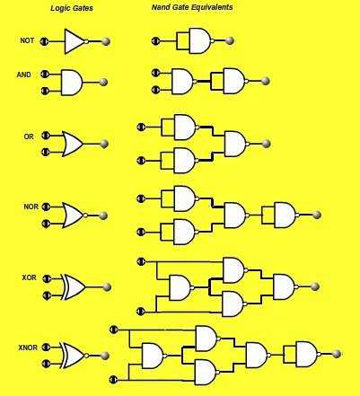

# 04: digital logic + breadboarding lab

## admin

### quiz

write the answers on your homework

[1]: # (The two possible values in Boolean logic can be described in multiple ways. List two ways.)

[2]: # (What are the three primary operators used in Boolean logic?)

[ note: ]: # (T1: Don’t tell M3 that we have a quiz today. )

### assignments

collect HW and skills review

### note

Notes for this lesson do not display correctly in github as of 2023-08. Github’s markdown display seems to not allow images in tables. You will be unable to view the logic gate symbols in the tables. 

The symbols display correctly in marktext and typora. 

## digital logic

The three primary logic operators used with Boolean logic are AND, OR, and NOT. 

| Type                                                         | Distinctive shape  (IEEE Std 91/91a-1991) | [Boolean algebra](https://en.wikipedia.org/wiki/Boolean_algebra) | [Truth table](https://en.wikipedia.org/wiki/Truth_table)    |
| ------------------------------------------------------------ | ---------------------------------------------- | ---------------------------------------------------------------- | ----------------------------------------------------------- |
| **[AND](https://en.wikipedia.org/wiki/AND_gate)**            |                         | $A \cdot B$                                                      | `A B Q` `0 0 0` `0 1 0` `1 0 0` `1 1 1` |
| **[OR](https://en.wikipedia.org/wiki/OR_gate)**              |                           | $A+B$                                                            | `A B Q` `0 0 0` `0 1 1` `1 0 1` `1 1 1` |
| **[NOT](https://en.wikipedia.org/wiki/NOT_gate)** (inverter) |                         | $\bar{A}$                                                        | `A Q` `0 1` `1 0`                                 |

Boolean algebra also has its own laws/rules. You will use these to simplify complex statements. 

| AND                             | OR                                   | law or rule          |
| ------------------------------- | ------------------------------------ | -------------------- |
| X•0  = 0                        | X+1  = 1                             | Annulment            |
| X•1  = X                        | X+0  = X                             | Identity             |
| X•X  = X                        | X+X  = X                             | Idempotent           |
| X•X’ =  0                       | X+ X’ =  1                           | Complement           |
| (X’)’=  X                       |                                      | Double  Negation     |
| X•Y  = Y•X                      | X+Y  = Y+X                           | Commutative          |
| X(YZ)  = (XY)Z =   (XZ)Y  = XYZ | X+(Y+Z)  = (X+Y)+Z = (X+Z)+Y = X+Y+Z | Associative          |
| X•(Y+Z)  = XY+XZ                | X+YZ  = (X+Y)•(X+Z)                  | Distributive         |
| (X•Y)’ =X’ +Y’                  | (X+Y)’ =X’ •Y’                       | de  Morgan’s Theorem |

Many additional gates are possible. 

| Type                                                    | Distinctive shape  (IEEE Std 91/91a-1991) | [Boolean algebra](https://en.wikipedia.org/wiki/Boolean_algebra) | [Truth table](https://en.wikipedia.org/wiki/Truth_table)    |
| ------------------------------------------------------- | ---------------------------------------------- | ---------------------------------------------------------------- | ----------------------------------------------------------- |
| **[Buffer](https://en.wikipedia.org/wiki/Buffer_gate)** |                 | A                                                                | `A Q` `0 0` `1 1`                                 |
| **[NAND](https://en.wikipedia.org/wiki/NAND_gate)**     |                       | $\overline{A \cdot B}$                                           | `A B Q` `0 0 1` `0 1 1` `1 0 1` `1 1 0` |
| **[NOR](https://en.wikipedia.org/wiki/NOR_gate)**       |                         | $\overline{A + B}$                                               | `A B Q` `0 0 1` `0 1 0` `1 0 0` `1 1 0` |
| **[XOR](https://en.wikipedia.org/wiki/XOR_gate)**       |                         | $A \oplus B$                                                     | `A B Q` `0 0 0` `0 1 1` `1 0 1` `1 1 0` |
| **[XNOR](https://en.wikipedia.org/wiki/XNOR_gate)**     |                       | $\overline{A \oplus B}$                                          | `A B Q` `0 0 1` `0 1 0` `1 0 0` `1 1 1` |

#### Apollo ICs

The Apollo Guidance Computer was made exclusively from ICs with dual 3-input NOR gates. 

- https://www.ibiblio.org/apollo/hrst/archive/1716.pdf 

- http://www.righto.com/2019/09/a-computer-built-from-nor-gates-inside.html

|  |  |
| -------------------------------------------------------------------------------------------------------------------------------------- | ---------------------------------------------------------------------------------------------------------------------------------- |

#### universal gates

NOR and NAND are *universal gates*: any logic gate can be be constructed solely from NOR gates, or solely from NAND gates. 

- NAND is the most common gate in integrated circuits

### example

Look at logic example from course text. 

## breadboarding lab

In the classroom, complete the logic exercise from the lab handout  `04 digital logic handout.docx`.

Review instructions from `../minilabs/04 logic and breadboarding.md`. 

### troubleshooting

When you get stuck, try on your own (in your group) to figure out what’s wrong. 

In the context of this course, it is always safe to connect a multimeter in volt mode. 

The simplest thing to do is check voltages down the chain of your circuit to see whether it matches your expectation. 

- power supply providing 5V/ground?
- breadboard rails providing 5V/ground? 
- circuit inputs?
- intermediate connections?
- circuit output?

### go do the lab!

## homework

- by next lesson: complete the assignment given on the in-class handout (`04 digital logic handout.docx`)
- by next lesson: watch these soldering tutorials
  - https://youtu.be/-qk-ulz05J8
  - https://youtu.be/eHu_fGAyNY4
