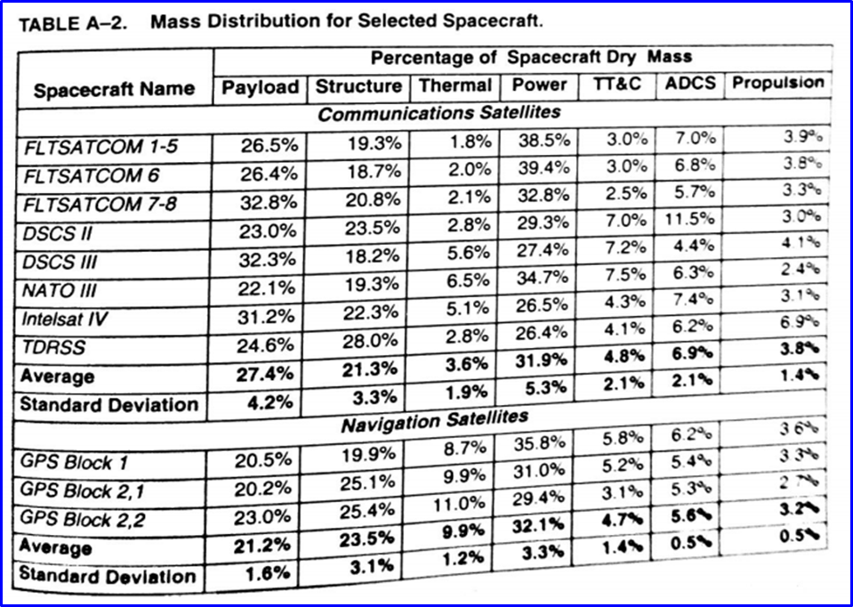
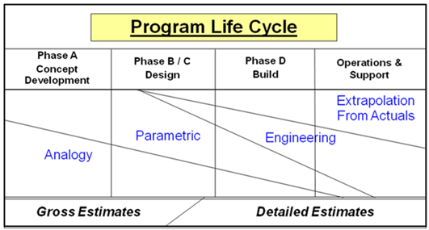
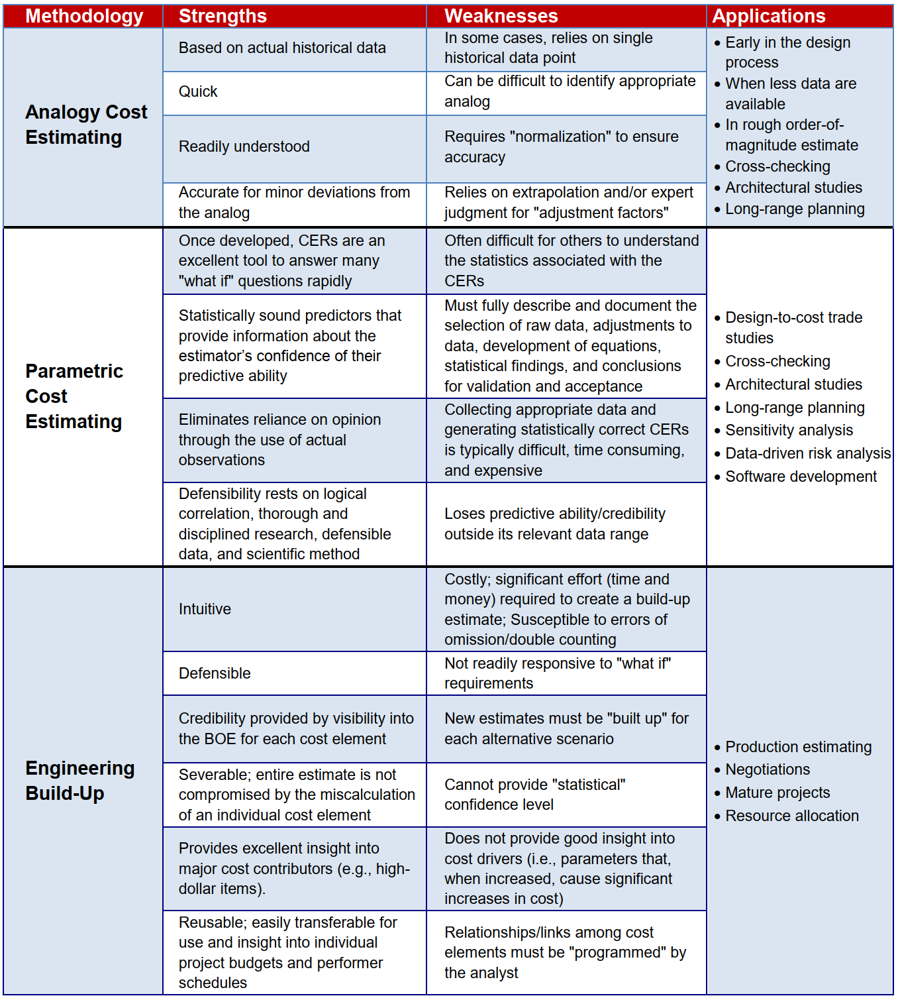
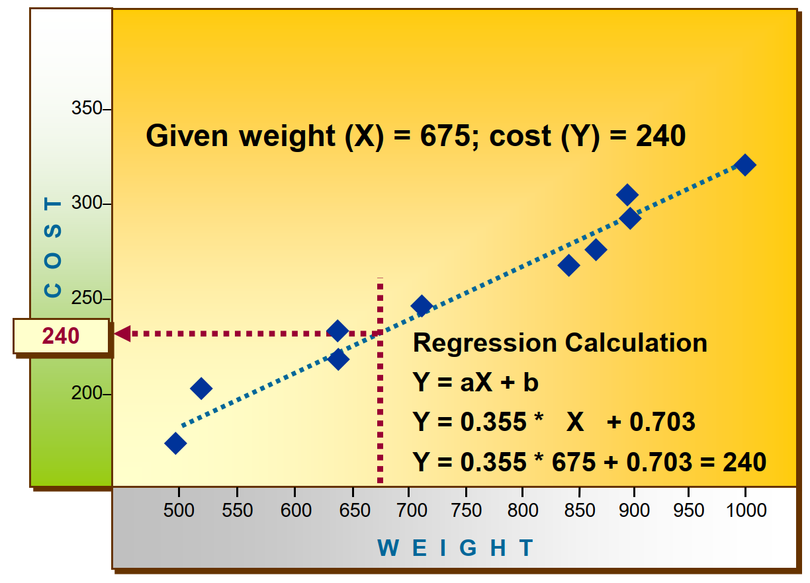
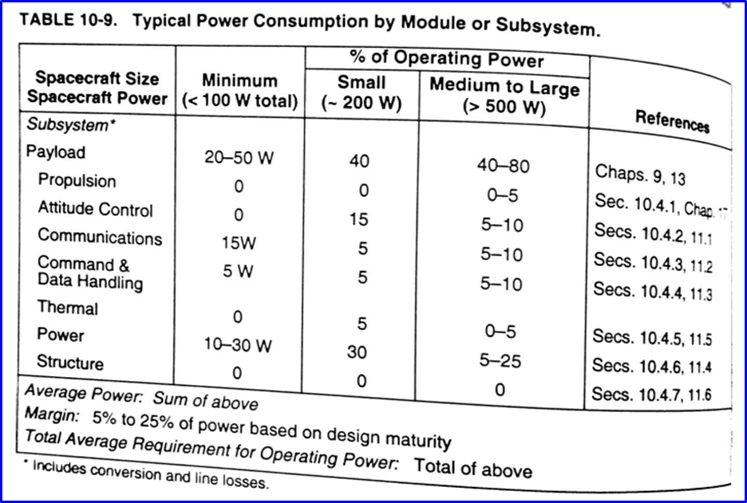

# 05 budgets, electricity (+ solar minilab)

## admin

## assignments

collect skills review (ensure all submitted in gradescope)

go over mission geometry homework

## budgets

> noun: **budget**; plural noun: **budgets**
>
> 1. an estimate of income and [expenditure](https://www.google.com/search?client=firefox-b-1-d&sa=X&sca_esv=600152964&biw=1467&bih=794&sxsrf=ACQVn0_9oFpqcrOnlUKJa36u8lAHqfESCg:1705807338502&q=expenditure&si=AKbGX_q4mkMHy1Nmq4yITjHYVzepNZyjgEq-7QlV8kSZsYKEM8a3tQaTbp25nPi5hUT3NayRUD5TxvZzFdJGquIJvj1dAz09cWvp5aHCdk-98xHt8McC0Hc%3D&expnd=1) for a set period of time.
>    "keep within the household budget"
>    - an annual or other regular estimate of national revenue and expenditure  put forward by the government, often including details of changes in [taxation](https://www.google.com/search?client=firefox-b-1-d&sa=X&sca_esv=600152964&biw=1467&bih=794&sxsrf=ACQVn0_9oFpqcrOnlUKJa36u8lAHqfESCg:1705807338502&q=taxation&si=AKbGX_qNq0Y8zql7SxzZAf2-HTTOh1bw_qQCWikf_hJXTbtVcH6PqaNHKRArxaMSdc4yWYZfTmhBdoemzlCLKj7kOVauDLaIr23TmaN7f10jS178N21VwDw%3D&expnd=1).
>
> - <mark> the amount of money needed or available for a purpose. </mark>
>   "they have a limited budget"
>
> - archaic
>
>   a quantity of material, typically that which is written or printed.
>
> verb: **budget**; 3rd person present: **budgets**; past tense: **budgeted**; past participle: **budgeted**; gerund or present participle: **budgeting**
>
> 1. allow or provide a particular amount of money in a budget.
>     "the university is **budgeting for** a deficit"
>    - provide (a sum of money) for a particular purpose from a budget.
>      "the council proposes to budget $100,000 to provide grants"
> 
> *adjective*
>
> adjective: **budget**
>
> 1. inexpensive.
>     "a budget guitar"
> 
> 
>
> Phrases
>
> [on a budget](https://www.google.com/search?client=firefox-b-1-d&sa=X&sca_esv=600152964&biw=1467&bih=794&sxsrf=ACQVn0_9oFpqcrOnlUKJa36u8lAHqfESCg:1705807338502&q=on+a+budget&si=AKbGX_qUj39a0n8Hk2tbKEk9_Hqd9DBXowuAu_JzveN8ETGv0xDlQWBw4wRigtB6jfJAAp_knHf2ebwc6iTggkkw07jST4zAmXf-Qrur2se5TTxUgsmlVVA%3D&expnd=1) — with a restricted amount of money.
>"we're traveling on a budget"
> 
> —from [Oxford Languages](https://languages.oup.com/google-dictionary-en) via [google](https://www.google.com/search?client=firefox-b-1-d&sca_esv=600152964&sxsrf=ACQVn0-tTZpyDaoeznhTEfpI2498xCv_xg:1705807322379&q=budget&si=AKbGX_qMqBjhUm3ZRWjCp4_5aZjJTq2_RiUbdgNhdKPatseWO7xduRbipOdvIE7wl1tm_qT625Bfbpk84nL62PYNBcsN_ADVxg%3D%3D&expnd=1&sa=X&ved=2ahUKEwjsrYW8w-2DAxVmlmoFHWnyBQQQ2v4IegUIGxCCAQ&biw=1467&bih=794&dpr=1.25#ip=1)

What do we budget? 

SWAP, etc. 

Today we’ll focus on mass—principles apply to other budgets. 

FalconSAT-3

|                | mass (kg) |
| -------------- | --------- |
| spacecraft     | 54.3      |
| grav-grad boom | 2.6       |
| boom tip mass  | 8         |
| FlaPS          | 0.5       |
| …              |           |

parametric:

We will briefly cover mass estimation using analogy method. This was covered in the course text. For today’s in-class example we will use data from SMAD 3. 

terms

- **[margin](https://www.merriam-webster.com/dictionary/margin)**: a spare amount or measure or degree allowed or given for contingencies or special situations
- **dry**: mass of the unfueled spacecraft

​	

Method

payload mass $\rightarrow$ spacecraft dry mass (incl margin)$\rightarrow$ subsystem mass

given: 

- comm spacecraft
  - payload mass: 250 kg 
  - payload power: 350 W
- margin: 25%

find: 

- s/c dry mass with margin

Can do the same for power

Assume analogous estimation is appropriate. What are some other problems with these SMAD tables?

## homework

- by next lesson: watch these soldering tutorials
  - https://youtu.be/-qk-ulz05J8
  - https://youtu.be/eHu_fGAyNY4
