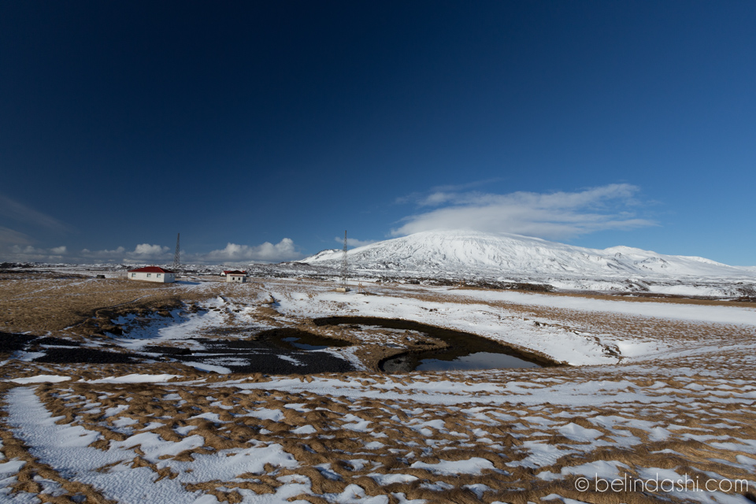
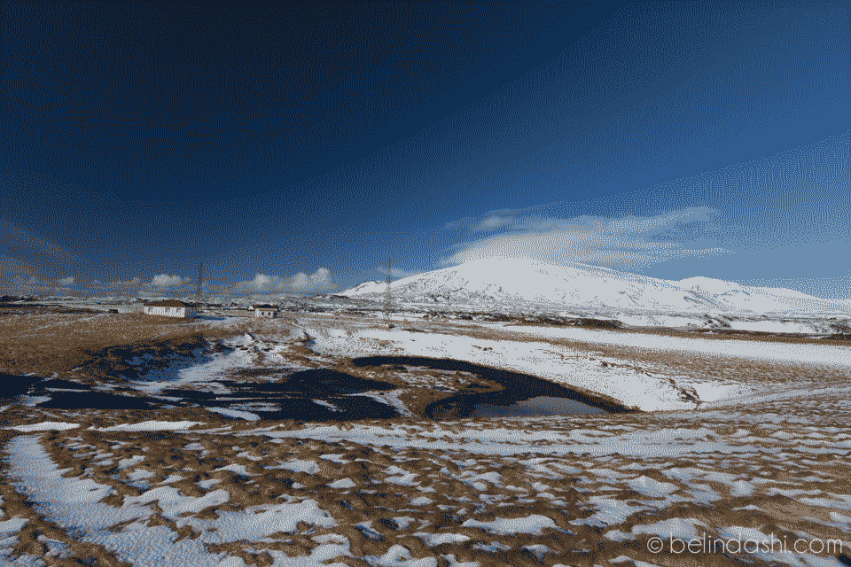
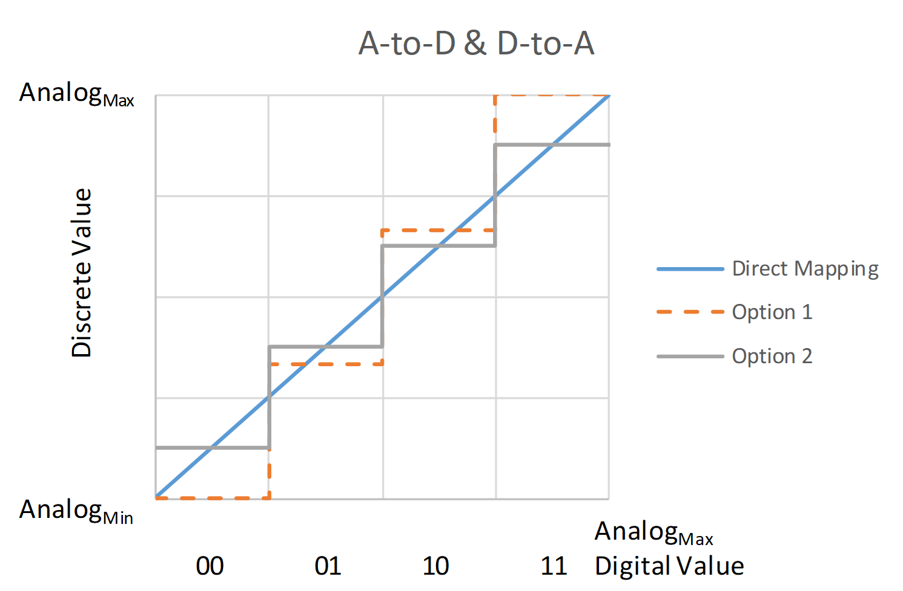
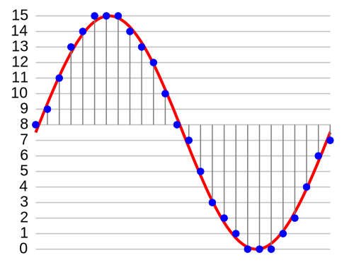
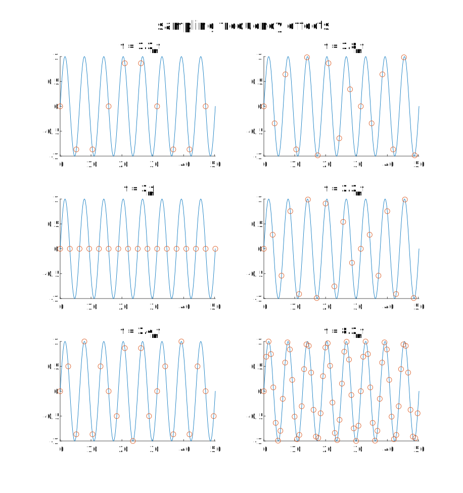

# 06: metrology

> metrology: the science of  measurement, embracing both experimental and theoretical determinations  at any level of uncertainty in any field of science and technology
> -International Bureau of Weights and Measures (BIPM) 

## admin

- will cover perturbations homework next time
- fill out timesheet—forgot last time?
- electrical prelab due soon
  - https://www.overleaf.com/read/mkfdycznthxz#02e935
  - review
  - copy this project for your own prelab—use as a template for your own report
  - create 3 empty projects (per group) for your 3 lab reports
    - share these with your group members and with me
  
    - your overleaf superpowers expire in February
  
    - existing projects remain accessible to all group members
  
    - the free/basic account still allows sharing between 2 people—fine for prelabs
  
- homework: Robinson/Richie paper on FalconSAT-3

## metrology

What do we measure from space?

How/what kind of measurements?

Analog/digital

other terms for each?

Chain of info:

| step       | conversion | A/D  |
| ---------- | ---------- | ---- |
| real world |            | A    |
| ADC        | A/D        |      |
| computer   |            | D    |
| radio      | D/A        |      |
| photons    |            | A    |
| radio      | A/D        |      |
| computer   |            | D    |
| DAC        | D/A        |      |
| analysis   |            | A    |

Discuss these photographs

Bad photograph:

Worse photograph:

Problem with 1st photo:

- differential polarization of sunny sky
  - circ polarizing filter on wide angle lens
- uninspiring subject
- fix: photoshop

Problem with 2nd photo:

- banding
- often see on big screen TVs with DVDs/streaming content
- insufficient color depth (this photo has 4-bit color—how many colors is that?)
- fix: Dolby color/HDR/10-bit color

We can measure any quantity with as many bits as we want/decide to. 

### quantization/discretization

#### Example

spacecraft fuel level

What will we actually measure?

- pressure?
- temperature?
- contact sensor?

How many bits is this example?

2 bits/4 levels

| **Analog Range** | Discrete  Value | Maximum  Error |
| ---------------- | --------------- | -------------- |
| **0-4 V**        | 2  V            | 2  V           |
| **4-8** **V**    | 6  V            | 2  V           |
| **8-12 V**       | 10  V           | 2  V           |
| **12-16 V**      | 14  V           | 2  V           |

#### equations

$$
Discrete\ num = A_{min} + (A_{max}-A_{min}) \left( \frac{Digital\ num}{2^n} + \frac{1}{2^{n+1}}  \right)
$$

$$
Quantization\ Step = \frac{(A_{max}-A_{min})}{2^n}
$$

$$
Error_{max}=\frac{(A_{max}-A_{min})}{2^{n+1}}
$$

What can we quantize?

- voltage (you will do this today)
- brightness
- current?
- acceleration
- force
- loudness/sound pressure

Representation of a PCM audio signal

How many levels? How many bits?

This represents a sound waveform.

There’s another dimension here—what is it?

### sampling frequency

How often must you sample a wave to recreate it? 
$$
f_s \geq 2.2 f_m
$$
Nyquist sampling criterion

human audio sensitivity: 20 Hz–20 kHz

CD audio: 16 bit/44.1 kHz

Tidal: 24 bit/192 kHz

(you won’t do this today)

### calibration

- ends of scale aren’t necessarily 0/15

- curve isn’t necessarily linear

- you have to build calibration curve

  - can be preflight design/engineering
  - can be in flight
  - both?

  

(you will do this today)

Watch this video.

https://youtu.be/_k9egfWvb7Y?si=0gWMrULNJZKLkbh3

Traceable/certified calibration

(you won’t do this today)

## lab

- voltage measurement with Arduino
- solder kit
