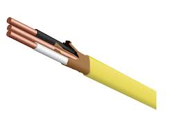
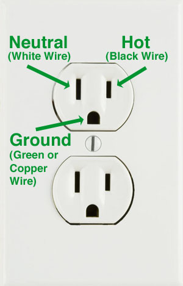
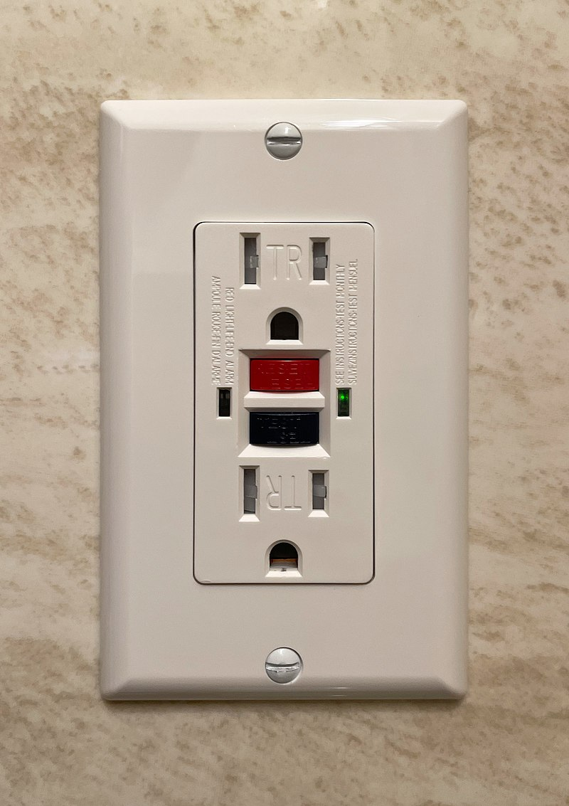
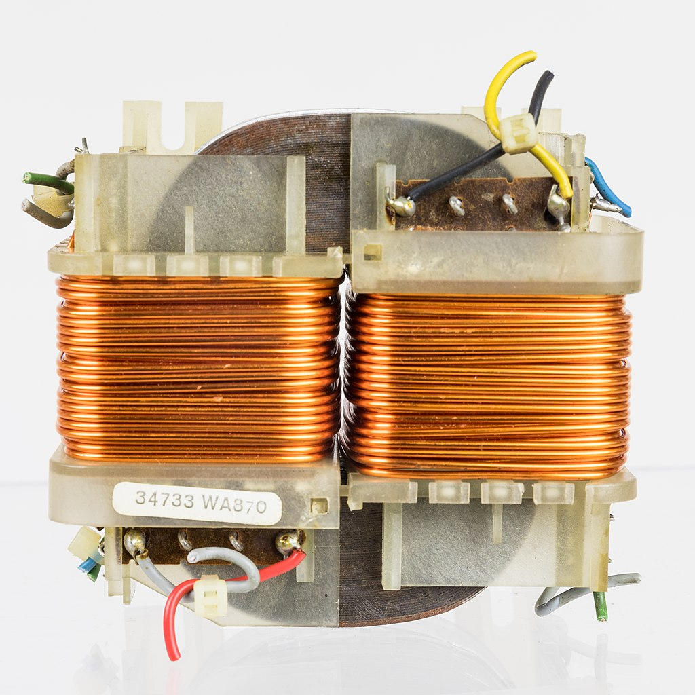
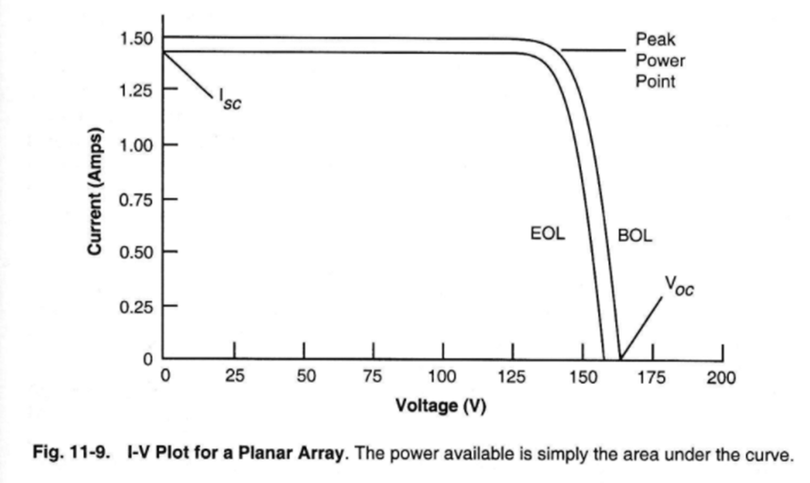
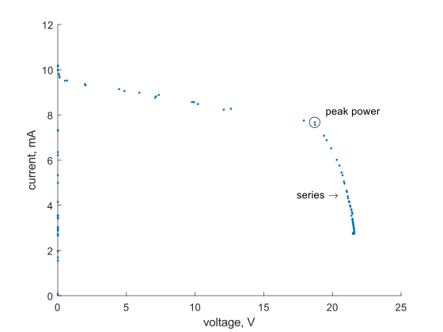
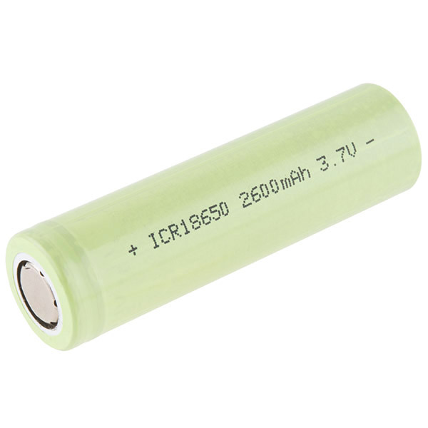
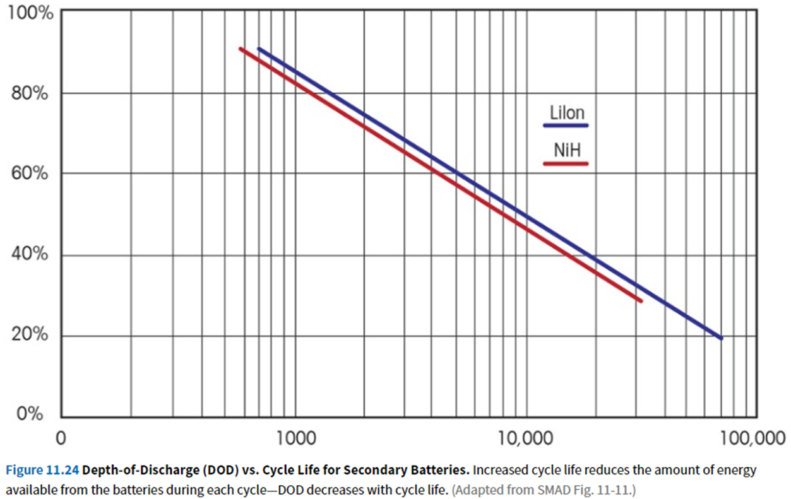

# 06: electrical system

## quiz

[1]: # (Draw the current configuration of the Sun-Earth-Moon system. Include the vernal equinox direction.)
[Bonus]: # (Add the James Webb Space Telescope)

[2]: # (FalconEye-1 is in a circular orbit with a radius of 8000 km and period of 1.978 hrs. The bus requires 535 W of power to operate and is always on. The payload requires 165 W of power to operate and is always on. Calculate the power the solar panels must produce to power FalconEye-1 in both the Sun and Eclipse.)

$$
\rho = \sin^{-1} \frac{R_{\oplus}}{R}
$$

$$
T_{ecl} = \frac{2 \rho}{360\degree} \mathbb{P}
$$

$$
P_{req} = \frac{ E_{sun}+E_{ecl}}{T_{sun}}
$$

## admin

### quiz answers

you already know electrical power system! goals today

- learn additional info about electricity
- more accuracy/fewer approximations
- gain idea of what these systems look like

### metrology lab

Everyone ran out of time. Finish today.

- solder your flashlights
- measure 30V from the power supply
- find count readings of your sun sensor in darkness and in bright sun (go to a window)

### assignments

- There is a lab next lesson 
- prelab report due

## electrical system

Usually called electrical power system (EPS). Why?

functions of the electrical power system

- energy generation
- energy storage
- energy distribution
- energy regulation

I used the word energy. What does that mean?

What are each of those functions?

Back up. This is a systems engineering class. What do we need first?

#### requirements

- power spacecraft (payload and bus) during eclipse and sunlight
  - peak power
  - average power
  - voltage?
  - current?

### practical electrical power systems

This class, this major, and this school should prepare you to serve in the USSF. What type of electrical system should we focus on?

Is that also relevant to the rest of the world? Why or why not? 

energy generation: array of photovoltaic cells

energy storage: battery of secondary electrochemical cells 

other relevant systems:

- primary cells sometimes used on launch vehicles
- springs often used to power deployment mechanisms (not electrical, but energy storage) 
- fuel cells used for human missions

### electricity fundamentals

Ohm’s law

$$
V = IR
$$

Power

$$
P = IV = I^2 R = V^2 /R
$$

Alternating current

### practical electricity

#### ground

electronics:

- green
- black
- white
- blue
- brown
- (mostly just not red)

household:

- green
- bare copper
- blue
- brown

#### safety

Electricity can damage:

- humans
- electronics
- facilities

GFCIs

### energy handling

- routing/transmission—wires
  - ampacity
  - [NASA-STD-8739.4 Workmanship Standard for Crimping, Interconnecting Cables, Harnesses, and Wiring](https://standards.nasa.gov/standard/NASA/NASA-STD-87394)
- voltage conversion
  - FlatSAT voltages
  - supply: 12 V/5 V 
  - motor: 12 V
  - Arduino MKR Zero: 3.3 V (can run from 5 V)
  - electromagnet: 5 V

### energy generation: solar arrays

history of the solar cell

- 1888 – Russian physicist [Aleksandr Stoletov](https://en.wikipedia.org/wiki/Aleksandr_Stoletov) built the first cell based on the outer [photoelectric effect](https://en.wikipedia.org/wiki/Photoelectric_effect) discovered by [Heinrich Hertz](https://en.wikipedia.org/wiki/Heinrich_Hertz) in 1887.[[11\]](https://en.wikipedia.org/wiki/Solar_cell#cite_note-11)
- 1904 – [Julius Elster](https://en.wikipedia.org/wiki/Julius_Elster), together with [Hans Friedrich Geitel](https://en.wikipedia.org/wiki/Hans_Friedrich_Geitel), devised the first practical photoelectric cell.[[12\]](https://en.wikipedia.org/wiki/Solar_cell#cite_note-12)
- 1905 – [Albert Einstein](https://en.wikipedia.org/wiki/Albert_Einstein) proposed a new quantum theory of light and explained the [photoelectric effect](https://en.wikipedia.org/wiki/Photoelectric_effect) in a landmark paper, for which he received the [Nobel Prize in Physics](https://en.wikipedia.org/wiki/Nobel_Prize_in_Physics) in 1921.[[13\]](https://en.wikipedia.org/wiki/Solar_cell#cite_note-13)
- 1954 – The first practical photovoltaic cell was publicly demonstrated at [Bell Laboratories](https://en.wikipedia.org/wiki/Bell_Laboratories).[[18\]](https://en.wikipedia.org/wiki/Solar_cell#cite_note-18) The inventors were [Calvin Souther Fuller](https://en.wikipedia.org/wiki/Calvin_Souther_Fuller), [Daryl Chapin](https://en.wikipedia.org/wiki/Daryl_Chapin) and [Gerald Pearson](https://en.wikipedia.org/wiki/Gerald_Pearson).[[19\]](https://en.wikipedia.org/wiki/Solar_cell#cite_note-19)
- 1958 – Solar cells gained prominence with their incorporation onto the [Vanguard I](https://en.wikipedia.org/wiki/Vanguard_I) satellite.

Directly convert light energy into electrical energy. 

How big do they need to be? How much energy do they need to provide?

view ppt animation

In the daylight portion of an orbit, they need to generate enough energy to power the spacecraft over it’s entire orbit. 

Astro 310: 
$$
P_{req} = \frac{ E_{sun}+E{ecl}}{T_{sun}}
$$
Astro 331: 
$$
P_{req} = \frac{ E_{sun}/ \eta_{sun}+E{ecl}/ \eta_{sun}}{T_{sun}}
$$

What is $E_{sun/ecl}$? Equation? Why different for sun/eclipse?

What is $\eta$? Why different for sun/eclipse? Which is higher?

What is the consequence of $\eta$?

#### IV curve

characteristic power profile of solar cells

This is for an array. What would it look like for a single cell? 

In series? In parallel? 

What voltage does spacecraft bus operate at? 

(book answer: 28V is a common voltage)

What voltage does this array provide to spacecraft?

Discuss

What about FlatSAT’s solar array?

All the old equations still apply. 
$$
P_{eol} = P_{bol} (1-annual \ degradation)^{time}
$$

$$
P_{bol} = A S \eta \cos \theta
$$

$$
S = 1358 \mathrm{W/m^2}
$$

#### eclipse length: 

These are the equations for the *max* eclipse. When is eclipse max? When is eclipse shorter? 
$$
\rho = \sin^{-1} \frac{R_{\oplus}}{R}
$$

$$
T_{ecl} = \frac{2 \rho}{360\degree} Per
$$

$$
P_{req} = \frac{ E_{sun}+E{ecl}}{T_{sun}}
$$

Max: when orbital plane aligns with…

ecliptic plane. 

Shorter: all other times

Shortest: no eclipse

- some (many) sun-synchronous orbits
- GEO for most of the year—why?

beta angle: angle between orbital plane and sun vector

- formally: angle between solar vector and its projection onto the orbit plane

Real cells

Rocketlab IMM: $\eta$ = 33% 

### energy storage: lithium ion batteries

$$
Cap = \frac{E_{ecl}}{DOD\ \eta}
$$

new: $\eta$ = round trip efficiency

#### energy capacity

SMAD:

| chemistry | specific energy (W hr/kg) |
| --------- | ------------------------- |
| Ni-Cd     | 25–30                     |
| Ni-H$_2$  | 35–57                     |
| Li-ion    | 70–110                    |

Why didn’t everyone use li-ion cells in 1998 (SMAD date)?

- flight heritage
- safety 
  - https://en.wikipedia.org/wiki/2013_Boeing_787_Dreamliner_grounding
  - see KULR battery presentation

2023 Eagle Picher Li-ion aircraft batteries: 70–415 W hr/kg

Why such a big range? 

## homework

- by next lesson
  - electrical prelab report