# 09: remote sensing

## quiz

[1]: # (What is the name of the shape below? How is it related to resolution?)

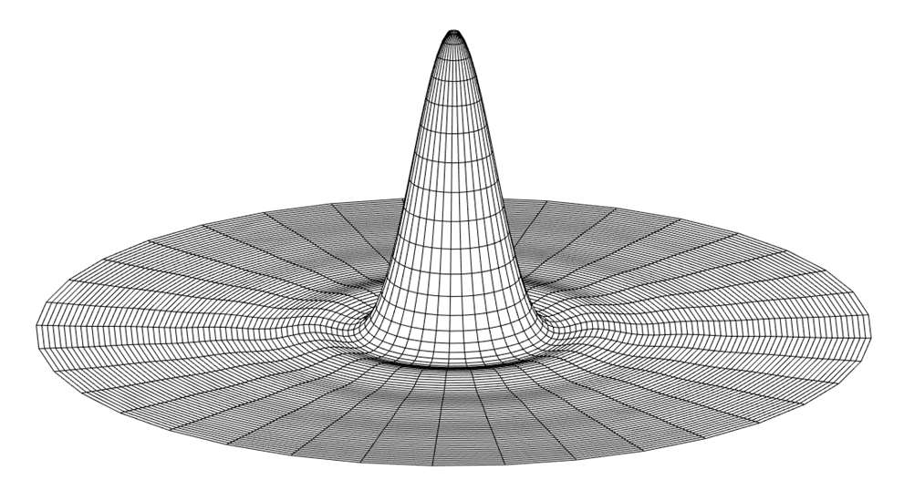

[1]: # (Calculate the diffraction-limited resolution for the visible-light sensor on Planet Labs’ Dove spacecraft. Dove is a 3U Cubesat. Altitude: 475 km. List your assumptions.)

$$
Res = \frac{2.44 \lambda h}{D}
$$

| 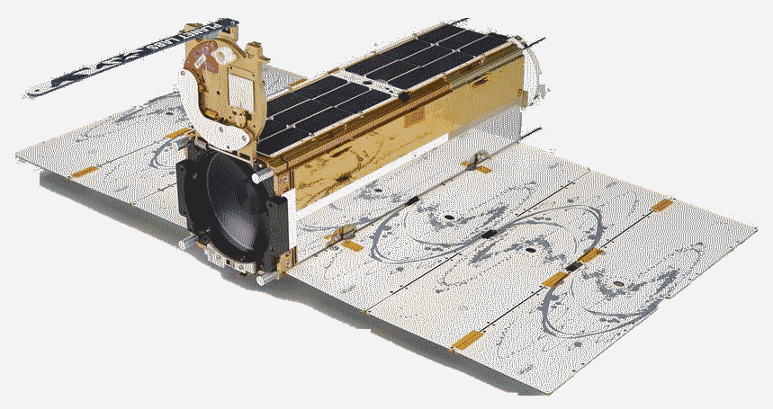 |  |
| ------------------------------------------------------------ | ------------------------------------------------------------ |

## admin

### quiz answers

### electrical lab

Almost everyone finished!

data

There is a lab next lesson. 

### assignments

- prelab report (individual) due next lesson
  - see lab instructions for link to prelab report instructions

### optical payloads lesson

### graphics

## remote sensing/optical payloads

you already know resolution! goals today

- broader view of remote sensing
- know resolution better
- know some real systems

#### remote sensing requirements

- subject
- wavelength(s)
- coverage area
- gaps
- revisit rate

### overview

> Remote sensing is the process of **detecting and monitoring the physical  characteristics of an area by measuring its reflected and emitted  radiation at a distance** (typically from satellite or aircraft). Special  cameras collect remotely sensed images, which help researchers "sense"  things about the Earth. Some examples are:
> 
> - Cameras on satellites and airplanes take images of large areas on  the Earth's surface, allowing us to see much more than we can see when  standing on the ground.
> - Sonar systems on ships can be used to create images of the ocean floor without needing to travel to the bottom of the ocean.
> - Cameras on satellites can be used to make images of temperature changes in the oceans.
> 
> Some specific uses of remotely sensed images of the Earth include:
> 
> - Large forest fires can be mapped from space, allowing rangers to see a much larger area than from the ground.
> - Tracking clouds to help predict the weather or watching erupting volcanoes, and help watching for dust storms.
> - Tracking the growth of a city and changes in farmland or forests over several years or decades.
> - Discovery and mapping of the rugged topography of the ocean floor  (e.g., huge mountain ranges, deep canyons, and the “magnetic striping”  on the ocean floor).
> 
> from [USGS.gov](https://www.usgs.gov/faqs/what-remote-sensing-and-what-it-used)

Need to see

- what
- where
- when

Analysis needed for (remote sensing cannot answer)

- who
- how
- why

## spectrum

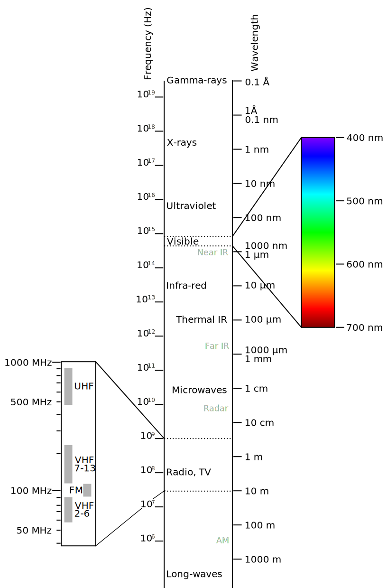
$$
c = \lambda f = 2.99792458 \times 10^8 \ \mathrm{m/s}
$$

Wien’s law

$$
\lambda_{max} = \frac{2.898 \ \times 10^{-3}}{T}
$$

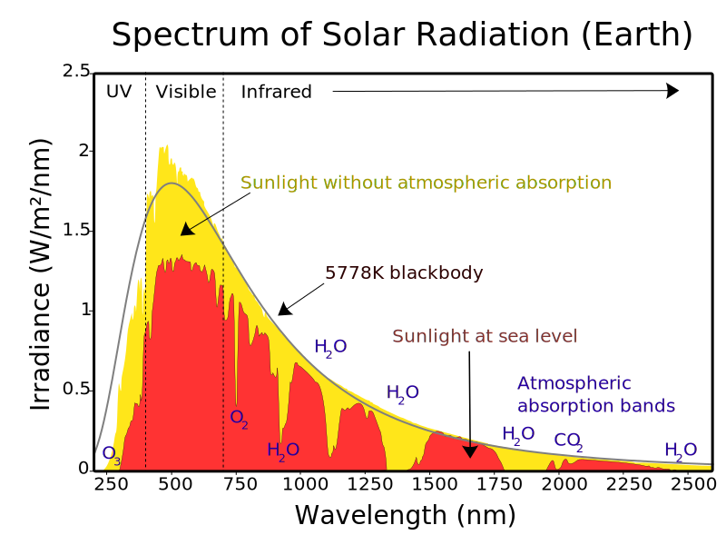

Bonus content: see spectra of various light sources https://research.ng-london.org.uk/scientific/spd/?page=spd&ids=15,16,10,23&noscale=0 

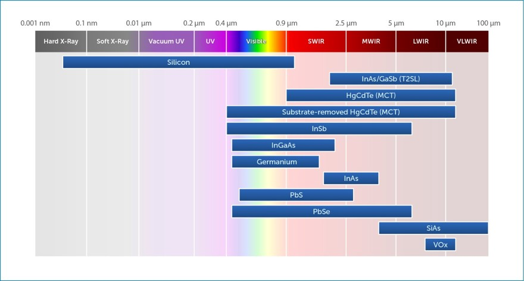

## optics

Optical system focuses light/EM radiation onto sensor. Location on sensor depends on object’s location within the telescope’s field of view. 

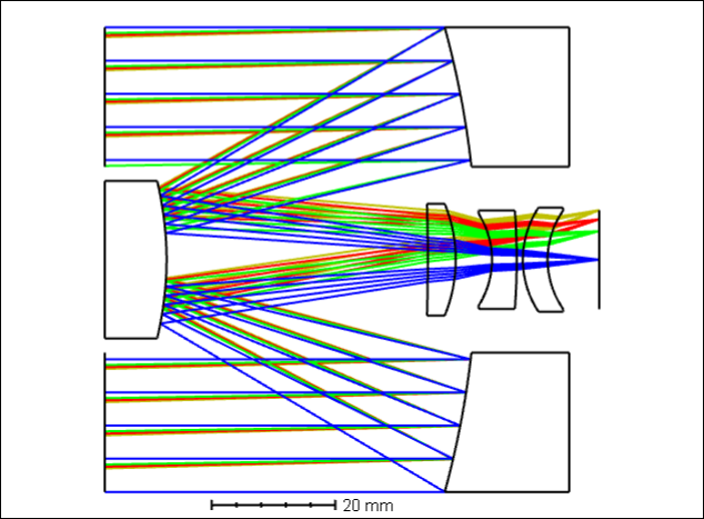

$$
\mathrm{magnification} = \frac{f}{h} = \frac{r_d}{R}
$$

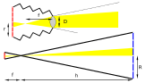

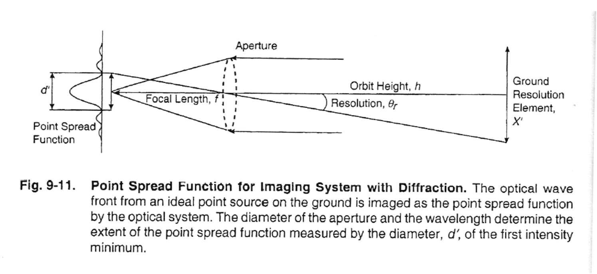

### diffraction-limited resolution

|  |  |
| ------------------------------------------------------------ | ------------------------------------------------------------ |

$$
Res = \frac{2.44 \lambda h}{D}
$$

### pixel-limited resolution

$$
Res = \frac{2R}{px}
$$

### resolution

What do you know about resolution? What is it? Which is better, bigger or smaller?

- $ Res=\frac{2.44 \lambda h}{D}$
- HD: 1920 x 1080
- Canon EOS R6: 20 MP
- Apple Retina display

> **resolution**
> 
> the smallest interval [measurable](https://www.google.com/search?client=firefox-b-1-d&sa=X&sca_esv=562371431&biw=1468&bih=793&sxsrf=AB5stBhRirgKRaYNYEZAq4eVNPtXt4ulUA:1693771425006&q=measurable&si=ACFMAn9-5A9OMKPWcg180I9o9MndJuk7StA-r0Nd3r1VpzlBxaS-jhUiyKBx923vEnSjKqNHSXgnYdC7Jgzork5_KyoG09euWg%3D%3D&expnd=1) by a scientific (especially optical) instrument; the [resolving](https://www.google.com/search?client=firefox-b-1-d&sa=X&sca_esv=562371431&biw=1468&bih=793&sxsrf=AB5stBhRirgKRaYNYEZAq4eVNPtXt4ulUA:1693771425006&q=resolving&si=ACFMAn8hzZSJQsgXIYlkGc-z1vmpLzzqDb-HYA4Uzs8LHMyf4RUfQLskl7sb9mRXEdy6ujQUiSElCOVlpDx7Wea71hZH8miEkQ%3D%3D&expnd=1) power.
> 
> - the degree of detail visible in a photographic or television image.
>   
>   "a high-resolution monitor"
> 
> -[Google](https://www.google.com/search?client=firefox-b-1-d&sca_esv=562371431&sxsrf=AB5stBg7ExTFwPB-Wa67SGv4uuDN6e6kZg:1693771420248&q=resolution&si=ACFMAn-S_tFEbe5J-h2tG_x3DZ9e92yWcGP7rb3n1HUpTqqdaE-dCInGGlwX8_O3Y9CiviHXrfN_4APdt5TY7KFvsU12iHyDBxKhwH7z1UlQZBi7KRJPSMc%3D&expnd=1&sa=X&ved=2ahUKEwjhpNaeno-BAxX5AjQIHcAgDGEQ2v4IegUIIBDdAQ&biw=1468&bih=793&dpr=1.25)

> **resolution**
> 
> 7. Optics. the act, process, or  capability of distinguishing between two separate but adjacent objects  or sources of light or between two nearly equal wavelengths.: Compare [resolving power](https://www.dictionary.com/browse/resolving-power). 
> 
> **resolving power**
> 
> 1. Optics. the ability of an optical device to produce separate images of close objects.
> 2. Photography. the degree to which a lens or photographic emulsion is able to define the details of an image.
> 
> -[Dictionary.com](https://www.dictionary.com/browse/resolution)

#### types of resolution

##### spatial

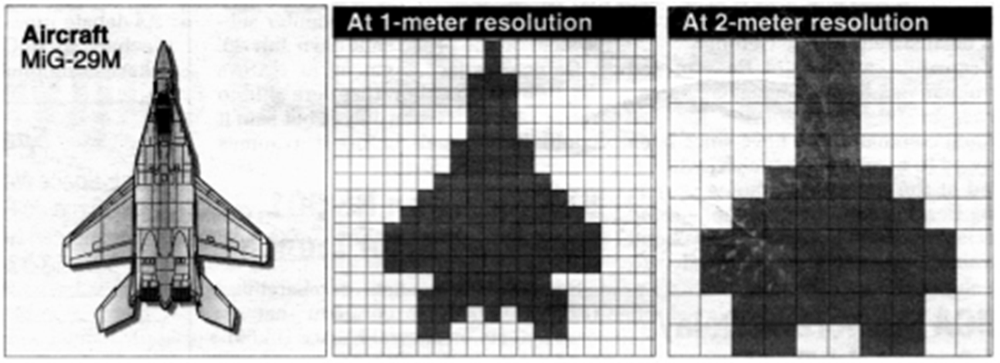

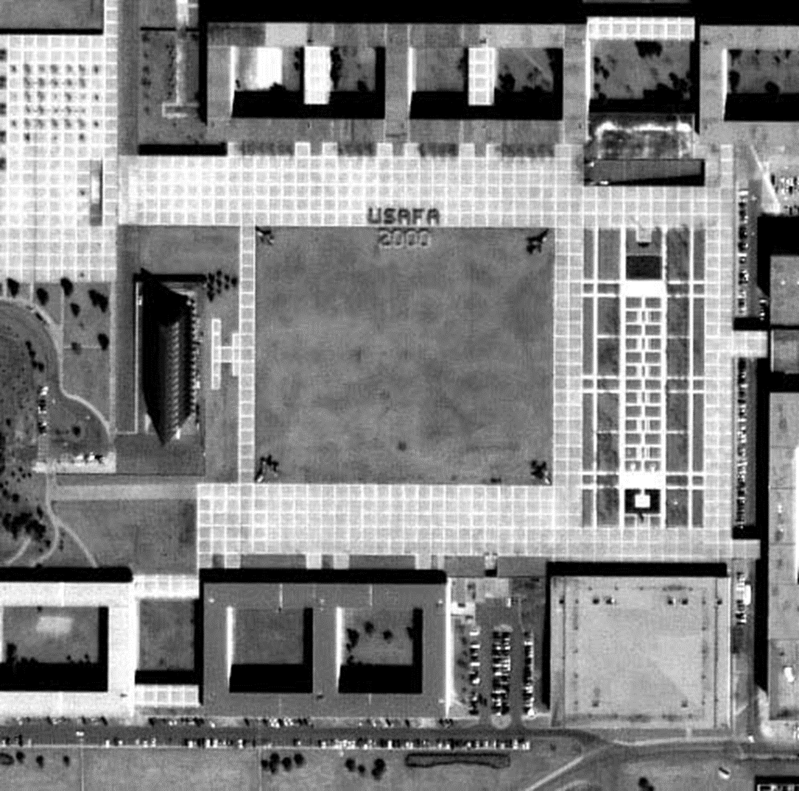

##### spectral

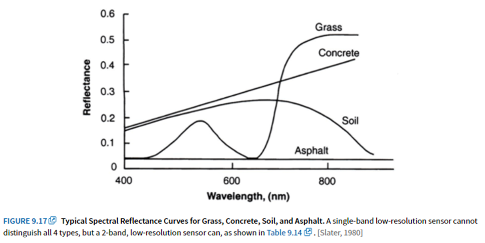

##### radiance

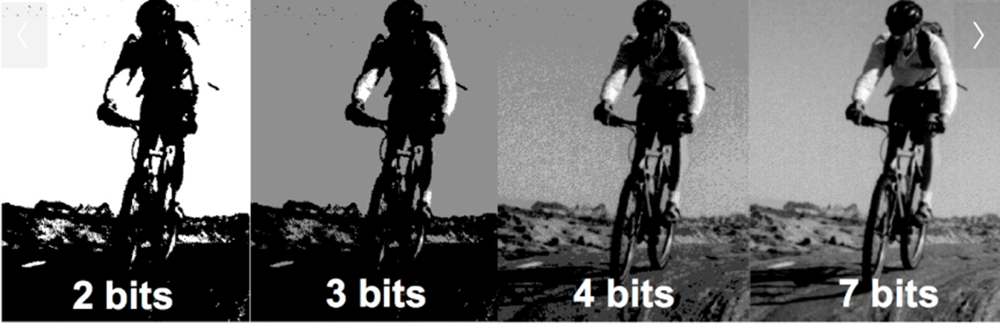

##### temporal

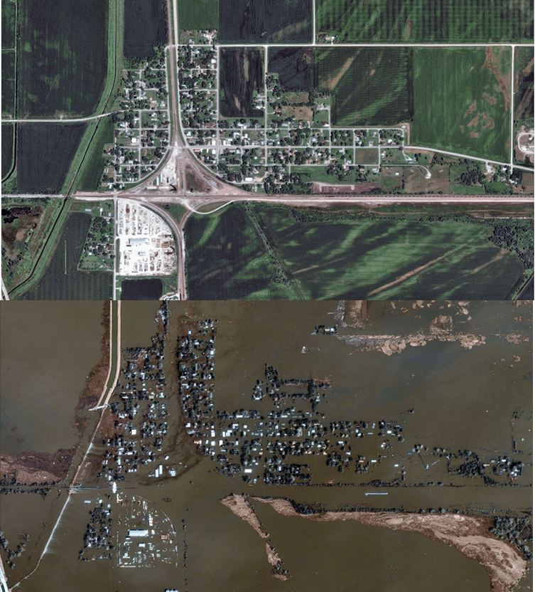

Digital Globe images of Pacific Junction, Iowa (Mar 2019)

## homework

- by next lesson
  - camera prelab report