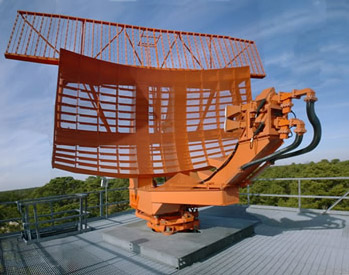

# 16: payloads

## admin

today

- payloads

next

- attitude lesson

 ## payloads

We’ve talked about optical remote sensing. 

How do we assess utility of an image? 

- resolution
- swath width

What about cloud cover? motion blur? focus? illumination?

NIIRS

https://irp.fas.org/imint/niirs_c/guide.htm#t1

> The National Imagery Interpretability Rating Scale (NIIRS) is a  task-based scale used for rating imagery acquired from various imaging  systems. The NIIRS originated in the Intelligence Community and is the  standard used by imagery analysts, collection managers, imagery  scientists, and sensor designers. The imagery analysis tasks that  comprise the NIIRS have, in the past, focused mainly on military  equipment. This document provides a scale that is relevant to  environmental and civil users and serves as a "stand-alone" reference.
>
> The concept underlying the NIIRS is that imagery  analysts should be able to perform more demanding interpretation tasks  as the quality or interpretability ofthe imagery increases. The NIIRS  consists of 10 graduated levels (O to 9), with several interpretation  tasks or *criteria* forming each level. These criteria indicate the amount of information that can be extracted from an image at a given  interpretability level. With a NIIRS 2 image, for example, analysts  should lust be able to *detect large buildings*, while on NIIRS 6 imagery they should just be able to *identify automobiles as sedans or  station wagons*.

What other useful payload types exist? 

| category       | subject           | example               | image/link                                     |
| -------------- | ----------------- | --------------------- | ---------------------------------------------- |
| remote sensing |                   |                       |                                                |
|                | visible light     | DOVE                  |                                                |
|                | IR                | GOES                  | https://www.youtube.com/watch?v=WBz_WHlbVic&t=4s |
|                | radio—SIGINT            | ORBCOMM AIS    |                                                |
|                | radio—SAR             | Capella, Iceye | https://www.youtube.com/watch?v=u2bUKEi9It4&t=2s https://www.iceye.com/vos-talk1-video-page (11:30) https://www.iceye.com/vos-talk3-video-page (14:44) https://www.iceye.com/vos-talk5-video-page (5:00, 15:00) |
| local sensing  |                   |                       |                                                |
|                | gravity           | GOCE                  | https://www.esa.int/Applications/Observing_the_Earth/FutureEO/GOCE/GOCE_the_first_seismometer_in_orbit |
|                | space environment |                       |                                                |
| local action  |                   |                       |                                                |
|  | refueling | NG’s mission extension vehicle |  https://news.northropgrumman.com/multimedia/video/space/spacelogistics-mev-2 (1:40) |
| communication  |                   |                       |                                                |
|                | emergency         | EPIRB, Garmin inReach |  |
|                | LEO ISP           | Starlink              |                                                |
|                | GEO ISP           | Hughes/VIASat         |                                                |
|                | text/voice        | Iridium               |                                                |
| positioning,  navigation,  timing |                   | GPS, Galileo,  Beidou, GLONASS,  Starlink? |                                                |

## subjects

### tracking airplanes

How do we track airplanes?

#### Primary radar (PSR—primary surveillance radar)

also called skin track radar

[ASR-9](https://en.wikipedia.org/wiki/Airport_surveillance_radar) airport surveillance radar antenna

(lower curved is reflector is for PSR)

What do these antennas do? 

Consider the shape and movement of the antenna in light of the resolution equation: 

$$
Res = \frac{2.44 \lambda h}{D}
$$

What is this radar system good at?

What is this radar system bad at?

(altitude)

Altitude is important for deconflicting airspace. How can we improve altitude resolution?

#### secondary radar (SSR—secondary surveillance radar)

Top reflector of the [ASR-9](https://en.wikipedia.org/wiki/Airport_surveillance_radar) airport surveillance radar antenna

When interrogated, the aircraft’s transponder replies with 

- 4-digit squawk code 
- altimeter reading

How do you get the additional altitude info? Ask the target. 

Can you make them reply?

1986 Operation El Dorado Canyon—attacking F-111s asked for “wind check” before bombing bases in Libya

#### Automatic Dependent Surveillance–Broadcast (ADS-B)

Requirement in U.S. airspace beginning 2020-01-01

All aircraft must continually transmit

- identification
- position
- altitude
- velocity

Could allow decommissioning of PSRs/SSRs

### tracking ships

marine radar/AIS (Automatic Identification System)

Big ships are tracked with AIS, which continually broadcasts information at approximately 162 MHz for maritime deconfliction and traffic management

- position
- velocity
- identification
- status

VHF range: 10-20 miles—limited by interference and Earth’s curvature

AIS signals can be received in space

Orbcomm receives AIS messages with its constellation of OG2 communication satellites. 

Orbcomm OG2 

- mass: 175 kg
- orbit: 750 km
- spacecraft: 18 (12 functional)

Resolution: 3400 km

Is this a remote sensing spacecraft? Communication spacecraft? 

Cooperative vs non-cooperative vs combative

What can you do if someone turns off their AIS transmitter?

​    tipping and cuing of other surveillance systems

##### phase

useful for interferometry

